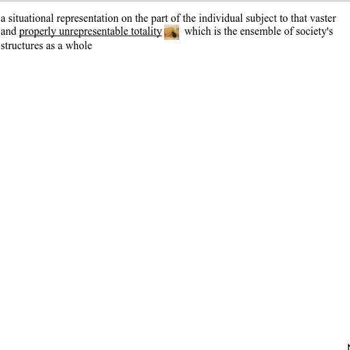

# darkgenius

text annotation effects for The New Inquiry

## usage

include the following in your html:

```
<link rel="stylesheet" href="https://omen.darkinquiry.com/css/darkgenius.css">
<script src="https://cdnjs.cloudflare.com/ajax/libs/jquery/3.2.1/jquery.min.js"></script>
<script src="https://omen.darkinquiry.com/js/darkgenius.js"></script>
```

effects are specified with a class `annotate` and an attribute `data-effect`.
additional attributes are specified as data attributes.

for example:

```
a situational representation on the part of the individual subject to that vaster and <span class="annotate" data-effect="inline" data-image="assets/cat.jpg">properly unrepresentable totality</span> which is the ensemble of society's structures as a whole
```

which results in:


